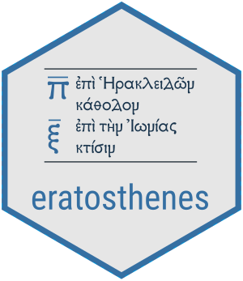

<!-- README.md is generated from README.Rmd. Please edit that file -->

```{r, include = FALSE}
knitr::opts_chunk$set(
  collapse = TRUE,
  comment = "#>",
  fig.path = "man/figures/README-",
  out.width = "100%"
)
```

#  eratosthenes: Tools for Archaeological Synchronism

<!-- badges: start -->
<!-- badges: end -->

The `R` package `eratosthenes` offers tools for estimating uncertain archaeological or historical dates subject to relational conditions and absolute constraits. The primary function of the package derives marginal densities of each event from the full, joint conditional distribution, provided relative sequences (derived via seriation or stratigraphic relationships) and external dating sources (such as radiocarbon dates, datable artifacts, or other known historical events). Absolute dates as derived from extrinsic information is stipulated as either a _terminus post quem_ or a _terminus ante quem_. Dates are estimated using a continuous uniform distribution between potential limits using a Gibbs sampler. Ancillary functions include checking for discrepancies in sequences of events and constraining optimal seriations to known sequences. 

Dates are estimated for the following types of events:

* **deposition**: the marginal density of the estimated date of the final deposition of a context or find-type.
* **externals**: the marginal density of the estimated date of any _terminus post quem_ or _terminus ante quem_, as affected by depositional variates in the joint conditional distribution.
* **production**: the marginal density of the production date of a given type or class of artifact, given the stipulation that the type's earliest date of production lies before its earliest date of deposition and after the depositional date of the context immediately prior.

See vignettes for more information on the package functionality. The package requires `Rcpp` for faster Gibbs sampling.

The package is named after Eratosthenes of Cyrene, author of the _Chronographiai_.

## Installation

To obtain the current development version of `eratosthenes` from GitHub, install from GitHub in the `R` command line with:

``` r
library(devtools)
install_github("scollinselliott/eratosthenes", dependencies = TRUE, build_vignettes = TRUE) 
```
