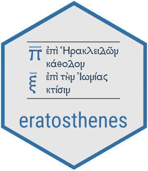

<!-- README.md is generated from README.Rmd. Please edit that file -->

#  eratosthenes: Tools for Archaeological Synchronism

<!-- badges: start -->
<!-- badges: end -->

The `R` package `eratosthenes` aims to provide a coherent foundation for
archaeological chronology-building by incorporating, computationally,
all relevant sources of information on uncertain archaeological or
historical dates. Archaeological dates are often subject to relational
conditions (via seriation or stratigraphic relationships) and absolute
constraints (such as radiocarbon dates, datable artifacts, or other
known historical events, as *termini post* or *ante quem*), which prompt
the use of a joint conditional probability density to convey those
relationships. The date of any one event can then be marginalized from
that full, joint conditional distribution, which is achieved using a
Gibbs sampler to draw estimates uniformly between potential earliest and
latest bounds. Ancillary functions include checking for discrepancies in
sequences of events and constraining optimal seriations to known
sequences.

While software exists for calibrating and conditioning radiocarbon dates upon
relative constraints, such as [BCal](https://bcal.shef.ac.uk/) (Buck,
Christen, and James 1999) and
[OxCal](https://c14.arch.ox.ac.uk/oxcal.html) (Bronk Ramsey 2009), the
aim of `eratosthenes` is to extend the application of probability theory
more generally to dating all archaeological phenomena, especially the production dates
of artifact types. `Rcpp` is required for faster Gibbs sampling.

The package is named after Eratosthenes of Cyrene, author of the
*Chronographiai*.

## Installation

To obtain the current development version of `eratosthenes` from GitHub,
install the package in the `R` command line with `devtools`:

``` r
library(devtools)
install_github("scollinselliott/eratosthenes", dependencies = TRUE, build_vignettes = TRUE) 
```

## Usage

The following comments are intended as a general introduction. See
vignettes for more information on the package functionality.

The basic objects of interest in `eratosthenes` are sequences of
relative events, typically stratigraphic deposits, but also isolated
contexts such as may be part of a frequency or contextual seriation.

The function `seq_check()` sees whether partial sequences agree in their
relative ordering of elements. The function `seq_adj()` provides the
means to coerce an “input” sequence to a discrepant “target” sequence
which contains fewer elements. E.g., if one has obtained an optimal
seriation of contexts (of both single, unrelated deposits and
stratigraphic deposits) as determined by the presence/absence of
find-types, which conflicts with a sequence obtained from a
stratigraphic sequence whose physical relationships are certain, this
function will reorder the optimal seriation accordingly, fitting any
single deposits missing from the stratigraphic sequence accordingly. The
package `eratosthenes` does not have functionality to produce serations,
as packages `seriation`, `vegan`, and `lakhesis` can perform this task
already.

At the core of `eratosthenes` is a Gibbs sampler, a common Markov Chain
Monte Carlo (MCMC) techinque (Geman and Geman
1984,buck_bayesian_1996,lunn_bugs_2013). Estimating marginal densities
is accomplished by the function `gibbs_ad()`, which will yield samples
for dates of deposition, production, and any absolute constraints
themselves (that is, the density of that extrinsic date as impacted by
all other events in the joint distribution).

### Input

The function `gibbs_ad()` takes as inputs the following objects:

- `sequences`: A `list` of relative sequences of contexts or events.
- `finds`: A `list` of any elements which belong to a context or event,
  which may be assigned a given type.
- `tpq` and `taq`: Separate `lists` that indicate any elements that
  provide extrinsic (i.e., absolute) chronological information, as
  *termini post* and *ante quem*.
- `alpha` and `omega`: lowest and highest bounds within which to sample.
- `trim`: whether to remove contexts from the output that are before or
  after user-provided *t.p.q.* and *t.a.q.* (i.e., those which depend on
  `alpha` and `omega`).
- `rule`: the rule for determining the earliest date of production of an
  artifact type. Initial threshold boundaries are first established
  between the earliest depositional context containing an aritfact of
  that type and the next earliest context which lacks it. Then, the
  following rules will sample a date accordingly:
  - `naive`: samples are drawn between the initial threshold sample and
    the depositional date of that artifact
  - `earliest`: samples are drawn within the initial threshold
    boundaries

Absolute dates can take any form:

- Single dates, e.g., `79` for 79 CE.
- Samples between two potential dates for a date range, e.g.,
  `runif(10^5, -91, -88)` for 91-88 BCE.
- Samples from a bespoke density, e.g., from a calibrated radiocarbon
  date. `eratosthenes` does not provide functionality for calibrating
  dates, which can be accomplished using preexisting software or
  directly from a calibration curve. As a brief example, given an
  uncalibrated date and its standard deviation, a crude sample of
  calibrated dates can be drawn from the IntCal20 curve data, available
  from IntCal [here](https://www.intcal.org/curves/intcal20.14c) (Reimer
  et al. 2020), using the following script:

``` r
intcal20 <- read.csv("../path/to/intcal20.14c")

# 14c date mean and st.dev.
mu <- 2040  
sigma <- 30

# samples of 14c date
uncalib <- round(rnorm(10^5, mu, sigma))

calib <- c()

for (i in 1:length(uncalib)) {
  x <- intcal20$CAL.BP[ intcal20$X14C.age == uncalib[i] ] 
  #g <- intcal20$Sigma[ intcal20$X14C.age == uncalib[i] ]

  if (length(x) > 0) {
    for (j in 1:length(x)) {
      calib <- c(calib, x[j])  
    }
  }
}

# samples of cal BC date
calBC <- 1950 - calib
hist(calBC, breaks = 100)
```

### Output

Results are given in a `list` object of class `marginals` contianing the
following objects:

- `deposition`: a `list` of the marginal densities of the date of the
  final deposition of contexts and finds.
- `externals`: a `list` of the the marginal densities of date of any
  *terminus post quem* or *terminus ante quem*, as affected by
  depositional variates in the joint conditional distribution.
- `production`: a `list` of the marginal densities of the production
  date of a given type or class of artifact, given the rule stipulated
  in the input.

## Bibliography

<div id="refs" class="references csl-bib-body hanging-indent">

<div id="ref-bronk_ramsey_bayesian_2009" class="csl-entry">

Bronk Ramsey, C. 2009. “Bayesian Analysis of Radiocarbon Dates.”
*Radiocarbon* 51: 337–60.

</div>

<div id="ref-buck_bcal_1999" class="csl-entry">

Buck, C. E., J. A. Christen, and G. N. James. 1999. “BCal: An On-Line
Bayesian Radiocarbon Calibration Tool.” *Internet Archaeology* 7.
<https://intarch.ac.uk/journal/issue7/buck/>.

</div>

<div id="ref-geman_stochastic_1984" class="csl-entry">

Geman, S., and D. Geman. 1984. “Stochastic Relaxation, Gibbs
Distributions, and the Bayesian Restoration of Images.” *IEEE
Transactions on Pattern Analysis and Machine Intelligence* 6: 721–41.

</div>

<div id="ref-reimer_intcal20_2020" class="csl-entry">

Reimer, P. J., W. E. N. Austin, E. Bard, A. Bayliss, P. G. Blackwell, C.
Bronk Ramsey, M. Butzin, et al. 2020. “The IntCal20 Northern Hemisphere
Radiocarbon Age Calibration Curve (0–55 Cal
<span class="nocase">kBP</span>).” *Radiocarbon* 62: 725–57.

</div>

</div>
